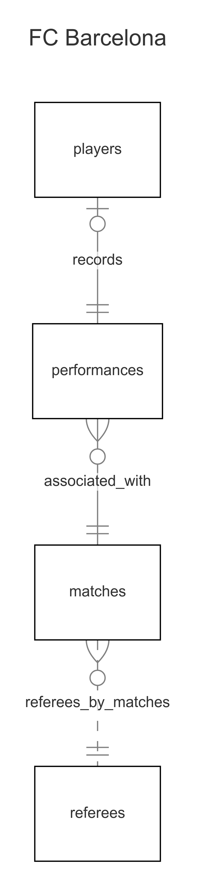

# Design Document

By Jose Castro Oviedo

Video overview: https://youtu.be/8L0eVQw5BIg

## Scope

In this section you should answer the following questions:

* What is the purpose of your database?

The purpose of this database is to provide the club, its fans, and anyone interested in the sport with access to data about FC Barcelona for the current season.

* Which people, places, things, etc. are you including in the scope of your database?

The database will include the players of the squad, their performance in each match, the matches of the current season, and the referees who have officiated these matches.

* Which people, places, things, etc. are *outside* the scope of your database?

The details of the opposing teams and their players are not considered. The club's coaching staff is not included, and previous seasons prior to the 2024-2025 season are not taken into account.

## Functional Requirements

In this section you should answer the following questions:

* What should a user be able to do with your database?

This database allows users to query the club's performance during the current season, its results in home or away matches, by competition, by opponent, among others. It also includes all player statistics for each match they have played, such as their rating, minutes played, goals, assists, and whether they were given a yellow or red card during the match. Lastly, it has a table dedicated to the referees who have officiated the team's matches.

* What's beyond the scope of what a user should be able to do with your database?

The database should be queried as needed, but it should not be modified in order to avoid any issues with the already registered data or the relationships between tables.

## Representation

### Entities

In this section you should answer the following questions:

* Which entities will you choose to represent in your database?

- players
- matches
- performances
- referees

* What attributes will those entities have?

- players: id, first_name, last_name, age, position, shirt_number, nacionality, contract_expiration, market_value
- matches: id, opponent, match_date, result, site, stadium, competition, attendance
- performances: id, player_id, match_id, rating, min_played, goals, assists, yellow_card, red_card
- referees: id, first_name, last_name

* Why did you choose the types you did?

For names of people, teams, and stadiums, I chose the TEXT type, as it is the most suitable for storing strings. For columns representing dates, I used the NUMERIC type because neither INTEGER nor REAL seemed appropriate. The REAL type, however, was suitable for representing the market_value of each player, as it is expressed in millions and may involve decimal values, as well as for the rating, which is always represented on a scale from 0 to 10 with one decimal. Next, I used the CHAR type for the result column because it is easy to identify with just one character. Finally, I used INTEGER where the column values are best represented by whole numbers, such as goals, assists, minutes played, and more.

* Why did you choose the constraints you did?

The CONSTRAINTS I used were primarily to ensure that the database doesn't have impossible values. For example, no player can have -1 assists in a match, and the same applies to goals and other columns in the data table. There are also CONSTRAINTS on columns where the values have limited and short options, such as the player's position, which only allows 4 options, or the match results, which only have 3 possible outcomes. Regarding player cards, for yellow cards, the maximum a player can receive is 2, and for red cards, it's 1, which limits the number of cards that can be added for each player.

### Relationships

In this section you should include your entity relationship diagram and describe the relationships between the entities in your database.

## Optimizations

In this section you should answer the following questions:

* Which optimizations (e.g., indexes, views) did you create? Why?

I chose only four VIEWS and one INDEX, thinking about how this table can be used by a member of the coaching staff, so I decided to create the following:

- la_liga_performance and champions_league_performance: These VIEWS are designed to visualize the team's performance in each competition and to analyze whether there is a different level of motivation, the difficulty of the matches, and other factors.
- players_by_avg_rating: This VIEW was created with the purpose of seeing which players have had the best performance in the season so they can be utilized more effectively. For those with lower ratings, it is important to investigate the reasons behind this and make adjustments to improve their performance.
- contracts_about_to_expire: This VIEW helps keep track of the contract expiration dates of each player, so that the club can plan for renewals or find an appropriate agreement to ensure a good outcome for both the club and the player.
- minutes_by_player: Managing player minutes is important to avoid injuries or muscle overload. Giving a player rest at the right time is more valuable than overusing them and risking a longer-term injury.
- idx_performances_player_id: This INDEX was created because the performances table is the most queried and heavily used with the player_id. Occasionally, it is also used with match_id, but I considered that it is not yet necessary to create an index for match_id, as the table's size does not yet justify it.

## Limitations

In this section you should answer the following questions:

* What are the limitations of your design?

- The performances table could include more advanced statistics, but only the essential ones were chosen to streamline the work, as the information was gathered from websites and manually transferred into .csv files.
- The matches table could include a column for the goal result of each match, not just whether it was a win, draw, or loss.
- The database only includes data for the current season; there is no information for seasons prior to 2024-2025.
- Regarding the referees, the role of each referee in the match could be added (main, assist 1, assist 2, VAR). Currently, only one referee (main) per match is recorded in the database.
- There is no extensive information about the opponents in each match, only the team name and, if it’s an away game, the name of their stadium.

* What might your database not be able to represent very well?

I believe this question is related to the previous one, however, I believe my database currently represents well what it has; it's just a matter of adding more tables with entities that provide a broader context of the club.